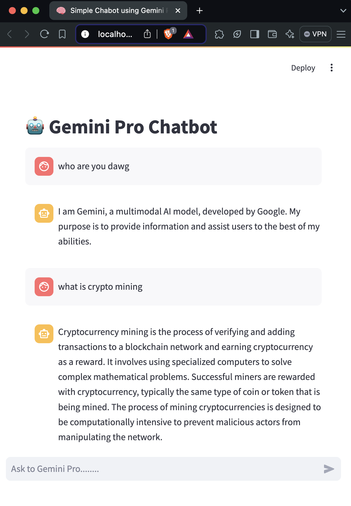
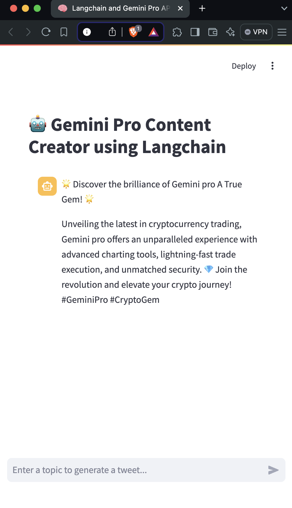

# Gemini-A-True-Gem

Welcome to my learning journey with **Gemini Pro**, Google's next-generation AI model. This repository serves as a documentation hub where I'll be sharing my experiences, key takeaways, and experiments as I explore the capabilities of Gemini Pro.

## 🚀 Project Overview

This repository aims to document my progress in learning and experimenting with **Gemini Pro**. I'll be focusing on understanding its architecture, potential use cases, and integrating it into various AI and NLP-based applications.

## 🧑‍💻 Learning Objectives

1. **Deep Dive into Gemini Pro**: Understand the unique features and architecture that make Gemini Pro a powerful AI model.
2. **Comparison with Other Models**: Explore how Gemini Pro stands out from other models like GPT, LLaMA, etc.
3. **Hands-on Experiments**: Implement real-world use cases, including chatbot development, content generation, and AI-driven solutions.
4. **Documenting Challenges and Solutions**: Capture the challenges faced during implementation, along with their solutions and best practices.

## 📂 Repository Structure

- `apps/`: Source code for various projects and use cases involving Gemini Pro.
- `docs/`: Contains detailed notes, explanations, and insights from different stages of the learning process.
- `notebooks/`: Jupyter Notebooks with code examples, experiments, and model integration tests.
- `data/`: Datasets used during experiments (where applicable).

## 📜 Key Topics Covered

- Introduction to Gemini Pro architecture
- Use case exploration: NLP, content generation, chatbots
- Model fine-tuning and optimization
- Real-world applications and challenges

## 💻 List of Projects

1. **Simple Chatbot using Gemini Pro API**
  

     
  

   - Build a basic chatbot leveraging the Gemini Pro API for natural language understanding and response generation.
   - [Project Code](app1/1_app.py)
   - Folder: `app1/`

2. **Gemini Pro Content Creator using Langchain Framework**
  

     
  

   - Implemented Gemini-pro API Chatbot using the Langchain framework. 
   - Learned how to use models from Ollama and monitored it through Langsmith.
   - [Project Code](app2/2_app.py)
   - Folder: `app2/`
   - 
3. **Context-Based Approach for Question Answering**  
   - Implement a context-based model that can answer complex queries using Gemini Pro’s advanced NLP capabilities.

4. **Fine-Tuning Gemini Pro for Custom Applications**  
   - Fine-tune the Gemini Pro model on specific datasets to optimize performance for custom use cases like student support chatbots.

5. **Sentiment Analysis with Gemini Pro**  
   - Analyze and classify sentiments from text inputs using the pre-trained Gemini Pro model.

6. **Content Generation Tool**  
   - Develop a content generation tool using Gemini Pro’s API for creating articles, summaries, or creative writing pieces.

*More as we go.....*

## 💡 How to Use This Repository

Feel free to explore the notes, code, and documentation.
